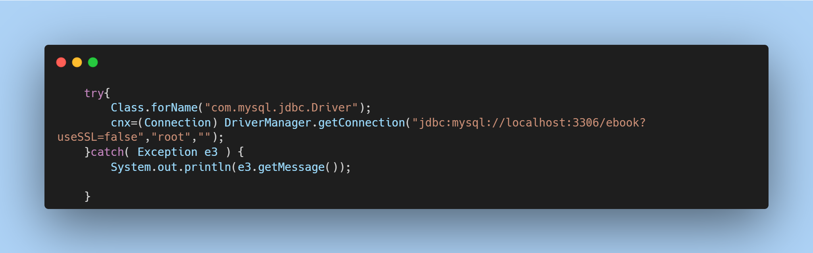
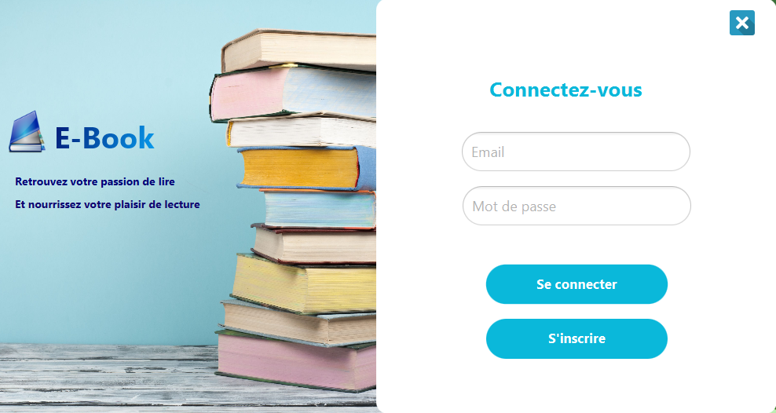
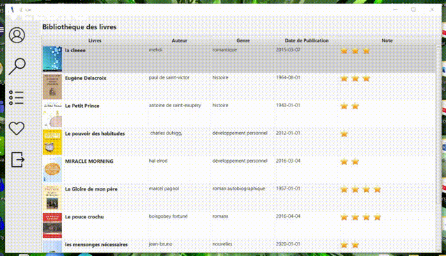
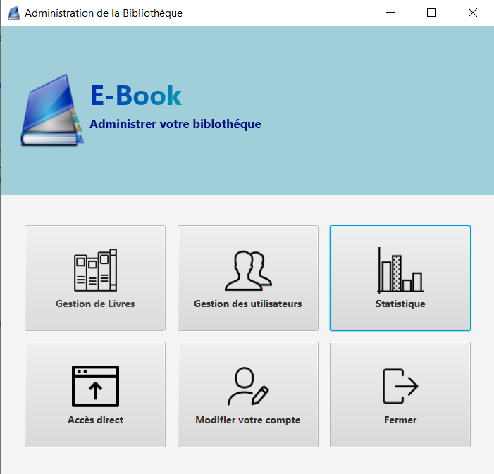
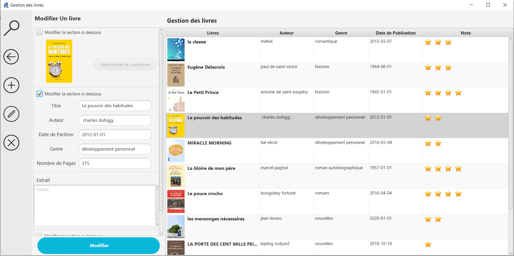
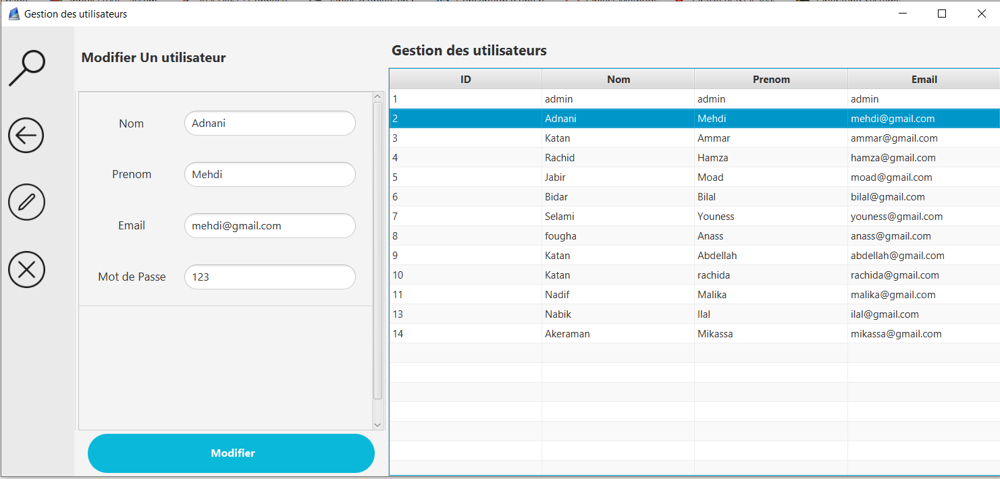
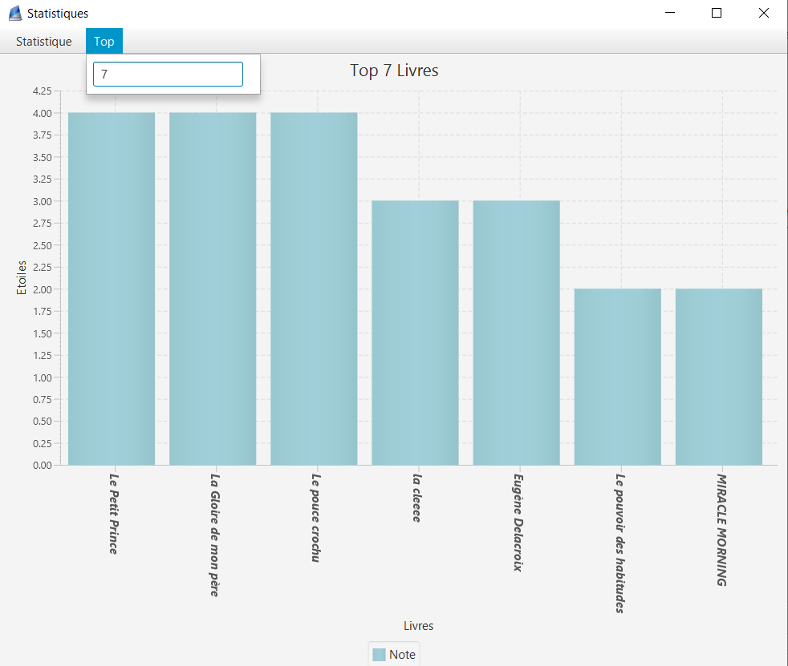

# E-Book

 

It's a desktop app developed with java. It represents an electronic library. it consists of two parts : backOffice and frontOffice.

- FrontOffice: is designed for normal users. after login, they could whether navigate through all the available books, rate them or add some books into favorite as well.
- BackOffice: is the private part for the admin. in which he can manage the books, users and even visualize some statistics related to books.

## Installation & Configuration

After setting up your environment to jdk 1.8. you are almost done the only thing left is changing database informations connexion to yours. first you have to go to ConnexionDB.java by following the following path "src/models/ConnexionDB.java". secondly, change database name (ebook) to your database name , username (root) as well as the password (i left it empty because i don't use one)

## How to use
### Login page
- Once running the app the first page is emerged which is login page

### FrontOffice
- The user can browse through the books add some of them to favorite, rate them, download books, etc..

### BackOffice
- As i mentioned. this part is dedicated for admin by which he can manage all the sort of books, users etc...
- it is accessible after the admin authentication (using admin as email and password)

#### Book management

#### User management

#### Book statistics

